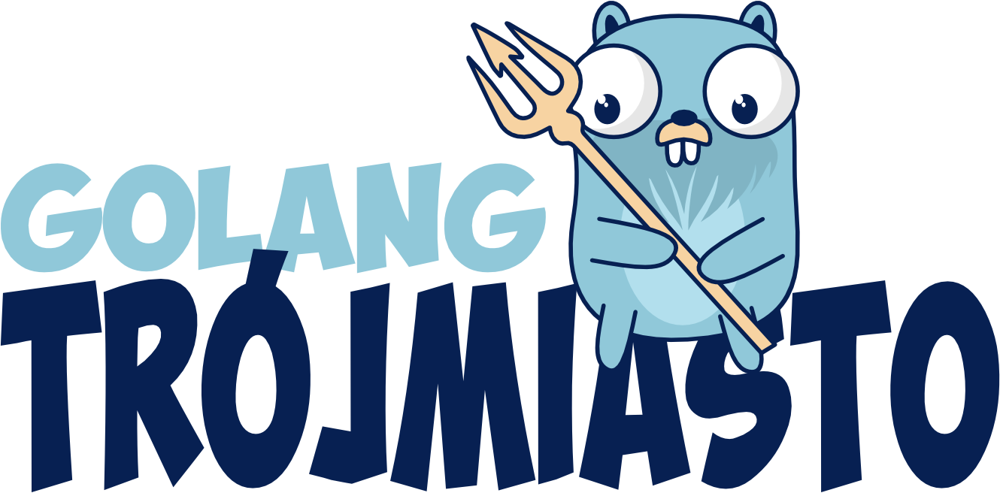

## Golang Trójmiasto
 
You will find us at https://mobilizon.pl/@golang_trojmiasto ([meetup as a backup](https://www.meetup.com/golang-user-group-trojmiasto/))

Want to be a speaker? Have an idea for building our community? Let us know on [Mobilizon](https://mobilizon.pl/@golang_trojmiasto) or [Meetup](https://www.meetup.com/golang-user-group-trojmiasto/).

## Golang Trójmiasto #9 (February 28th, 2025)

Talks:

1. [Jak zacząć w Go?](./2025/2025_9_Meetup_Tricity/jak_zaczac_w_go.pdf) - Mateusz Reszka ([GitHub](https://github.com/smoorg/invoice-maker))
2. [Go 1.24 updates](./2025/2025_9_Meetup_Tricity/Go_1.24_updates.pdf) - Patryk Orwat

## Golang Trójmiasto #8 (January 14th, 2025)

Talks:

1. [Building infrastructure orchestration software](./2025/2025_8_Meetup_Tricity/building-infrastructure-orchestration-software.pdf) - Patryk Orwat

Meetup: [#8](https://www.meetup.com/golang-user-group-trojmiasto/events/304693009/)
